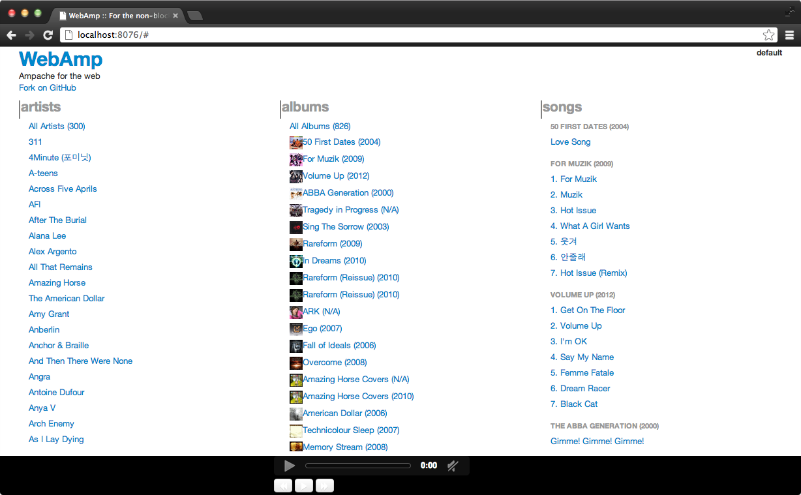
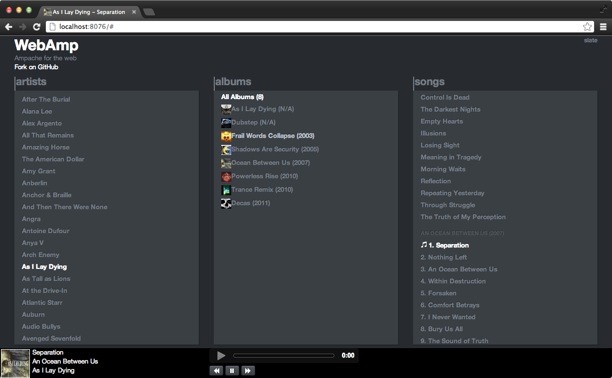
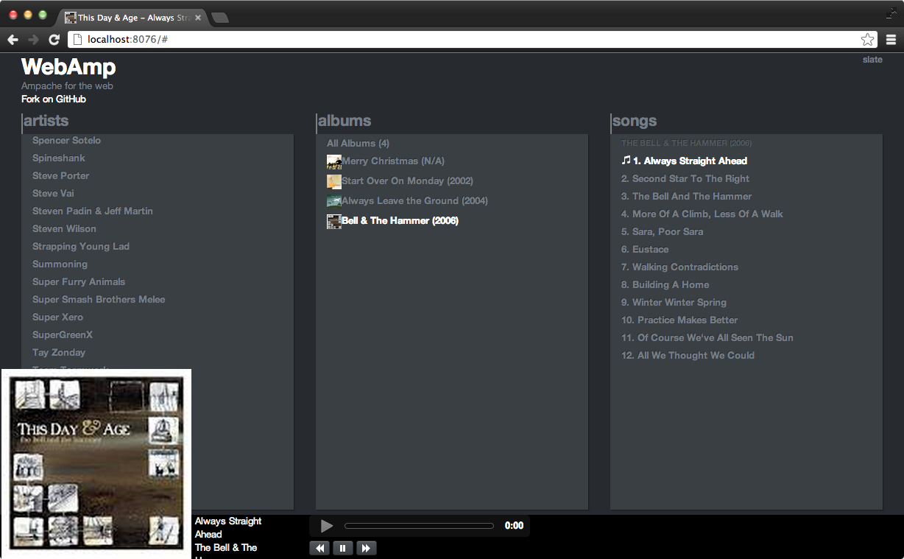
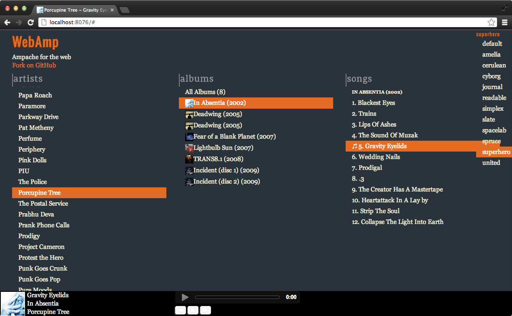
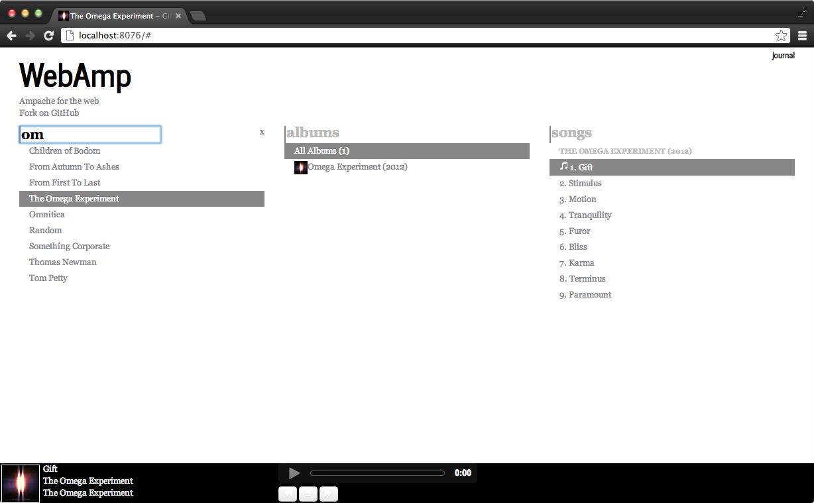

WebAmp
======

Ampache web interface to make browsing, and playing your music a simple task

---

- [Screenshots](#screenshots)
- [Install](#install)
- [Usage](#usage)
- [Credits](#credits)
- [License](#license)

Screenshots
-----------

### Easily view all of your music

### Themes made easy by bootswatch

### Cache album art for quick access

### More themes!

### Filter and quickly search your music

Install
-------

First install [Node](http://nodejs.org), then install this program using [NPM](http://npmjs.org)

    npm install -g ampache-webamp

Usage
-----

Create the necessary config file by running

    webamp --init

This will create a json file at `~/.webamp/config.json` that will be used
to configure the local webserver settings, as well as store the ampache credentials.
Modify this file to reflect your setup, and then run `webamp` to start the service.

    ~$ webamp
    Server running at http://localhost:8076/
    Successfully Authenticated!
    Populating cache
    Artists cache loaded
    Albums cache loaded
    Songs cache loaded
    [Sat Aug 11 2012 00:15:52 GMT-0700 (PDT)] [GET] request received from 127.0.0.1 for /api/artists/7/new

Credits
-------

* [Ampache](http://ampache.org) - Without this, you wouldn't be able to listen to your music!
* [Twitter Bootstrap](http://twitter.github.com/bootstrap/) - Layout made easy
* [Bootswatch](http://bootswatch.com/) - Themes made easy

License
-------

MIT License
